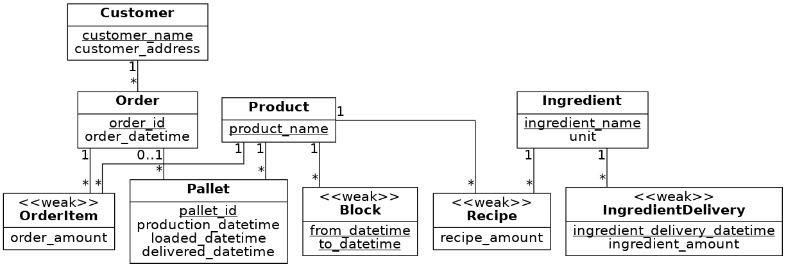

# EDAF75, project report

This is the report for

 + Johannes Larsson `jo7855la-s`
 + Ludvig Lifting ``
 + Emil P. Lundh `tna14elu`

We solved this project on our own, except for:

 + The Peer-review meeting
 + ... describe any other help you've gotten ...


## ER-design

The model is in the file [`er-model.png`](er-model.png):

<center>
    
</center>

## Relations

The ER-model above gives the following relations

+ products(**product_name**)
+ recipes(***product_name***, ***ingredient_name***, recipe_amount)
+ customers(**customer_name**, customer_address)
+ pallets(**pallet_id**, product_name, production_datetime, *order_id*, loaded_datetime, delivered_datetime)
+ orders(**order_id**, *customer_name*, order_datetime)
+ order_items(***order_id***, ***product_name***, order_amount)
+ ingredients(**ingredient_name**, unit)
+ ingredient_deliveries(_**ingredient_name**_, **ingredient_delivery_datetime**, ingredient_amount)
+ blocks(***product_name***, **from_datetime**, **to_datetime**)


## Scripts to set up database

The scripts used to set up and populate the database are in:

 + [`create-schema.sql`](create-schema.sql) (defines the tables), and
 + [`initial-data.sql`](initial-data.sql) (inserts data).

So, to create and initialize the database, we run:

```shell
sqlite3 krusty-db.sqlite < create-schema.sql
sqlite3 krusty-db.sqlite < initial-data.sql
```

(or whatever you call your database file).

## How to compile and run the program
```shell
make db
make start
```

to run the tests:
```shell
make test
```
(while the server is running)
